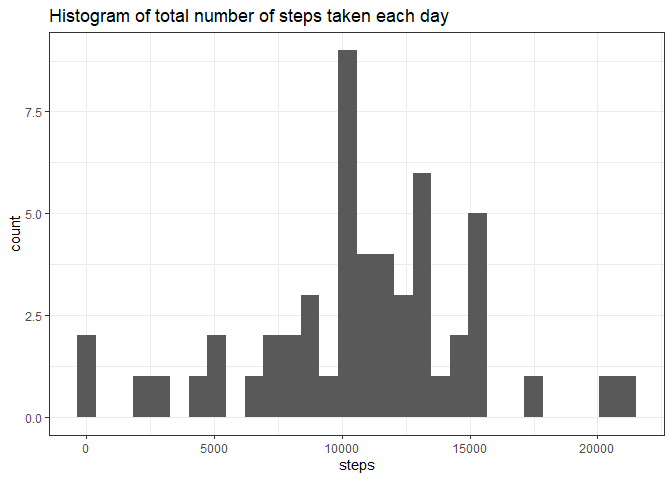

### Loading and Preprocessing the data

Reading the data


```r
data_course<-read.csv("./Data/Reproducible research/activity.csv")
```

Adding dat format to the "date" variable:


```r
data_course$date<-as.Date(strptime(data_course$date, format="%Y-%m-%d"))
```


### What is mean total number of steps taken per day?

1. Using the "aggregate" function to calcuate the total number of steps per day, saving the output in the data frame "agg_steps"


```r
agg_steps<-aggregate(steps~date, FUN="sum", data=data_course)
```

2. Now, using ggplot2 plotting system to make the histogram, the plot was coded as follows:


```r
library(ggplot2)
gg_hist<-ggplot(agg_steps, aes(steps))+geom_histogram()
gg_hist+labs(title = "Histogram of total number of steps taken each day")+theme_bw()
```

```
## `stat_bin()` using `bins = 30`. Pick better value with `binwidth`.
```

<!-- -->

3. The mean and median of the total number of steps is calculated in this way:


```r
prom<-mean(agg_steps$steps)
med<-median(agg_steps$steps)
```
And its values correspond to mean = 1.0766189\times 10^{4} and median = 10765


### What is the average daily activity pattern?

1. First, It`s necessary to calculate the average number of steps by interval across all days, saving the output in the variable called "agg_average":


```r
agg_average<-aggregate(steps~interval, FUN="mean", data=data_course)
agg_average$interval<-as.numeric(agg_average$interval)
```

Now, using ggplot2 plotting system, the plot is coded as follows:


```r
gg_timeserie<-ggplot(agg_average, aes(interval,steps))+geom_line()+labs(title="Time serie of the average number of steps by interval time")
gg_timeserie
```

<!-- -->

2. To find the interval with the maximun average number of steps is used the "which.max" function:


```r
max_interval<-agg_average$interval[which.max(agg_average$steps)]
```
And the interval number corresponds to 835.


### Imputing missing values

1. The total number of missing values in the dataset is calculated as follows:


```r
n_na<-sum(is.na(data_course$steps))
```

And it`s correspond to 2304

2. For imputing missing values, it will be used the mean steps for each interval, because there is a day (2012-10-01) without steps values in any interval.


3. Now, it will be generated a new dataset with the missing data filled in. For that, it will be used a for-loop:


```r
data_filled<-data_course
intervals<-unique(data_filled$interval)
for (i in 1:length(intervals)){
    mean_interval<-mean(data_filled$steps[data_filled$interval==intervals[i]], na.rm = TRUE) #calculating the median interval
    data_filled$steps[which(data_filled$interval==intervals[i] & is.na(data_filled$steps)==TRUE)]<-mean_interval #imputing the median-day value where there is a NA value
}
```

4. It will be repeated the process followed at the second question of the course project, that is (i) calculate the total number of steps per day and (2) make the histogram using ggplot2 plotting system:


```r
agg_stepsfilled<-aggregate(steps~date, FUN="sum", data=data_filled)
```


```r
library(ggplot2)
gg_histfilled<-ggplot(agg_stepsfilled, aes(steps))+geom_histogram()
gg_histfilled+labs(title = "Histogram of total number of steps taken each day (Filled version)")+theme_bw()
```

```
## `stat_bin()` using `bins = 30`. Pick better value with `binwidth`.
```

<!-- -->


```r
prom_filled<-mean(agg_stepsfilled$steps)
med_filled<-median(agg_stepsfilled$steps)
```

As it can be viewed, the mean-day value is equal to 1.0766189\times 10^{4}, same value calculated before (question 2). But now the median-day value is equal to 1.0766189\times 10^{4} same as the mean-day value, this value increase, though just a little, as a result of imputing missing data.


### Are there differences in activity patterns between weekdays and weekends?

1. First, it will be generated the variable "type_day" aplying the "weekdays()" function over the "date" variable:


```r
data_filled$type_day<-weekdays(data_filled$date)
```

Now, it will be classified the values of the variable "type_day" in "weekday" or "weekend", note that the language setup is spanish, then it will be transformed de variable into a factor:


```r
data_filled$type_day[which(data_filled$type_day %in% c("sábado","domingo"))]<-"weekend"
data_filled$type_day[which(data_filled$type_day %in% c("lunes","martes","miércoles","jueves","viernes"))]<-"weekday"
data_filled<-transform(data_filled, type_day=factor(type_day))
```

2. To make the plot, it`s necessary to calculate the average number of steps per interval across all days (same as in question 3), then using ggplot2 plotting system is possible to generate the plot with facings according to "type_day" variable:


```r
agg_averagewd<-aggregate(steps~interval+type_day, FUN="mean", data=data_filled)
agg_averagewd$interval<-as.numeric(agg_averagewd$interval)
```


```r
wd_timeserie<-ggplot(agg_averagewd, aes(interval,steps))+geom_line()+facet_grid(.~type_day)+labs(title="Time serie of the average number of steps by interval | Weekday vs Weekend")
wd_timeserie
```

<!-- -->

As it can be observed, there are clear differences between weekdays and weekend, for example, in weekdays is the peak of average steps, but after the number of steps falls bellow 125-100 steps, while in weekend the average steps is over 100-150 steps in various of the intervals.


